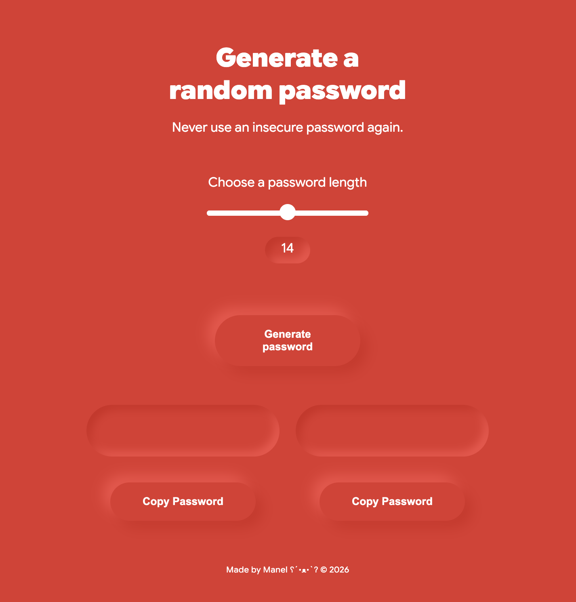
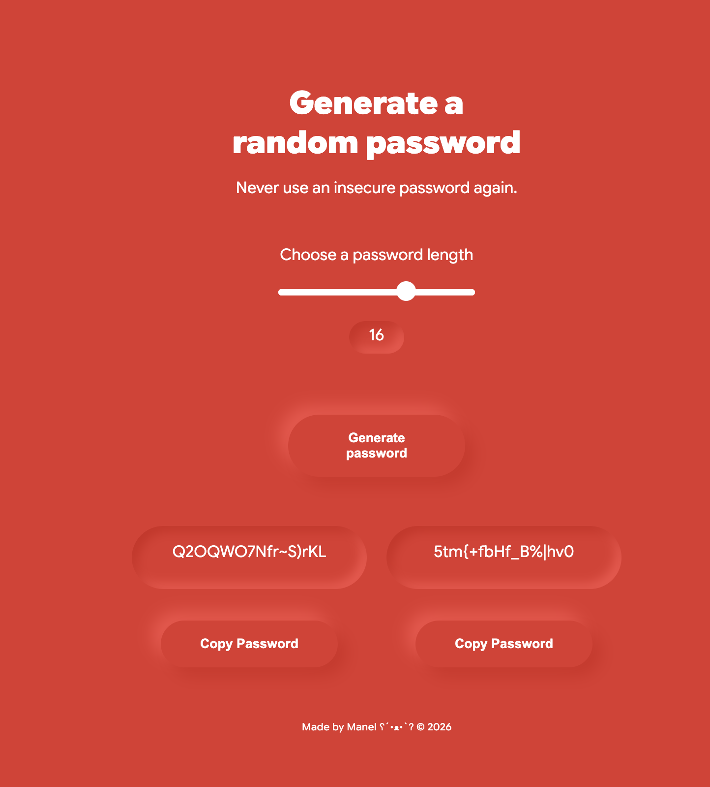

# 🔐 A Random Password Generator

If your password is either `Dottieboo` or `AhBooChai123`, give this random password generator a go.  
It generates **2 passwords** of 15 characters long, consisting of all characters from uppercase 'A' to that obscure `/` slash.

---

## The Interface

  


---

## Working Logic

1. **The Characters**: An array of letters (uppercase and lowercase included), numbers, and “special characters”.  
2. **The Repetition**: A `for` loop that repeats itself 15 times (according to the length of `passwordLength`).  
3. **The Options**: Generates **two passwords at once**, so you can choose from either one.

---

## How the Characters Were Chosen Randomly

The randomness is powered by the classic JavaScript combo:

```javascript
let randomIndex = Math.floor(Math.random() * characters.length);
let randomChar = characters[randomIndex];
